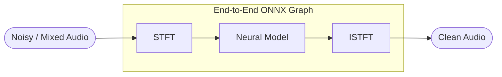

# Audio-Denoiser-ONNX

**Speech enhancement · denoising · echo cancellation · separation · super-resolution — powered by ONNX Runtime**

**语音增强 · 降噪 · 回声消除 · 语音分离 · 超分辨率 — 由 ONNX Runtime 驱动**

---

`STFT` / `ISTFT` are baked into every ONNX graph — feed in noisy audio and get clean audio straight out, with **no external pre- or post-processing**.

> `STFT` / `ISTFT` 已内置于每个 ONNX 计算图中：输入带噪音频，直接输出清晰音频，**无需任何额外的前后处理**。

- **Input / 输入:** noisy · mixed audio &nbsp;→&nbsp; **Output / 输出:** clean, enhanced audio
- **14 models / 14 个模型** across 5 tasks / 覆盖 5 类任务 — each folder ships `Export`, `Inference`, and `Optimize` scripts.
- More projects / 更多项目: **[DakeQQ Repositories / 仓库](https://github.com/DakeQQ?tab=repositories)**

---

## Supported Models · 支持的模型

| Task · 任务 | Model · 模型 | Rate · 采样率 | Code · 代码 | Source · 来源 |
| --- | --- | :---: | --- | --- |
| Denoise / SE 降噪 · 增强 | ZipEnhancer | 16 kHz | [`ZipEnhancer`](./ZipEnhancer) | [ModelScope](https://modelscope.cn/models/iic/speech_zipenhancer_ans_multiloss_16k_base) |
| Denoise / SE 降噪 · 增强 | MossFormerGAN-SE | 16 kHz | [`MossFormerGAN_SE_16K`](./MossFormerGAN_SE_16K) | [ModelScope](https://www.modelscope.cn/models/alibabasglab/MossFormerGAN_SE_16K) |
| Denoise / SE 降噪 · 增强 | MossFormer2-SE | 48 kHz | [`MossFormer2_SE_48K`](./MossFormer2_SE_48K) | [ModelScope](https://www.modelscope.cn/models/alibabasglab/MossFormer2_SE_48K) |
| Denoise / SE 降噪 · 增强 | DFSMN | 48 kHz | [`DFSMN`](./DFSMN) | [ModelScope](https://modelscope.cn/models/iic/speech_dfsmn_ans_psm_48k_causal/summary) |
| Denoise / SE 降噪 · 增强 | GTCRN | 16 kHz | [`GTCRN`](./GTCRN) | [GitHub](https://github.com/Xiaobin-Rong/gtcrn) |
| Denoise / SE 降噪 · 增强 | H-GTCRN | 16 kHz | [`H-GTCRN`](./H-GTCRN) | [GitHub](https://github.com/max1wz/h-gtcrn) |
| Denoise / SE 降噪 · 增强 | UL-UNAS | 16 kHz | [`UL-UNAS`](./UL-UNAS) | [GitHub](https://github.com/Xiaobin-Rong/ul-unas) |
| Echo Cancellation 回声消除 | SDAEC | 16 kHz | [`SDAEC`](./SDAEC) | [GitHub](https://github.com/ZhaoF-i/SDAEC) |
| Echo Cancellation 回声消除 | DFSMN-AEC | 16 kHz | [`DFSMN_AEC`](./DFSMN_AEC) | [ModelScope](https://modelscope.cn/models/iic/speech_dfsmn_aec_psm_16k) |
| Echo Cancellation 回声消除 | NKF-AEC | 16 kHz | [`NKF_AEC`](./NKF_AEC) | [GitHub](https://github.com/fjiang9/NKF-AEC) |
| Echo Cancellation 回声消除 | Deep Echo | 16 kHz | [`Deep_Echo_AEC`](./Deep_Echo_AEC) | [GitHub](https://github.com/ZhaoF-i/Deep-echo-path-modeling-for-acoustic-echo-cancellation) |
| Speech Separation 语音分离 | MossFormer2-SS | 16 kHz | [`MossFormer2_SS_16K`](./MossFormer2_SS_16K) | [ModelScope](https://www.modelscope.cn/models/alibabasglab/MossFormer2_SS_16K) |
| Vocal Separation 人声分离 | Mel-Band-Roformer | 44.1 kHz | [`Mel_Band_Roformer`](./Mel_Band_Roformer) | [GitHub](https://github.com/KimberleyJensen/Mel-Band-Roformer-Vocal-Model) |
| Super-Resolution 超分辨率 | MossFormer2-SR | 16 → 48 kHz | [`MossFormer2_Super_Resolution`](./MossFormer2_Super_Resolution) | [ModelScope](https://www.modelscope.cn/models/alibabasglab/MossFormer2_SR_48K) |

> **Mel-Band-Roformer** ships in both [Mono](./Mel_Band_Roformer/Mono) and [Stereo](./Mel_Band_Roformer/Stereo) variants. · 提供 [Mono](./Mel_Band_Roformer/Mono) 与 [Stereo](./Mel_Band_Roformer/Stereo) 两种版本。

---

## Performance · 性能

**Real-Time Factor (RTF)** = processing time ÷ audio duration — **lower is better** (`RTF < 1.0` is faster than real-time). Chunk size is `16000` samples (1000 ms) unless noted.

> 实时因子 (RTF) = 处理耗时 ÷ 音频时长，数值越低越好（`RTF < 1.0` 表示快于实时）。除特别注明外，分块大小为 `16000` 采样点（1000 毫秒）。

| OS · 系统 | Device · 设备 | Backend · 后端 | Model · 模型 | Precision · 精度 | RTF |
| --- | --- | --- | --- | :---: | :---: |
| Ubuntu 24.04 | Desktop · i3-12300 | CPU | ZipEnhancer | f32 | 0.32 |
| Ubuntu 24.04 | Desktop · i3-12300 | OpenVINO-CPU | ZipEnhancer | f32 | 0.25 |
| macOS 15 | MacBook Air · M3 | CPU | ZipEnhancer | f32 | 0.25 |
| Ubuntu 24.04 | Desktop · i3-12300 | CPU | MossFormerGAN-SE-16K | f32 | 1.085 |
| Ubuntu 24.04 | Desktop · i3-12300 | OpenVINO-CPU | MossFormerGAN-SE-16K | f32 | 0.95 |
| Ubuntu 24.04 | Desktop · i3-12300 | CPU | MossFormer2-SE-48K | f32 | 0.09 |
| Ubuntu 24.04 | Laptop · i5-7300HQ | CPU | DFSMN | f32 | 0.0068 – 0.012 |
| Ubuntu 24.04 | Desktop · i3-12300 | CPU | GTCRN | f32 | 0.0036 |
| macOS 15 | MacBook Air · M3 | CPU | GTCRN | f32 | 0.0013 – 0.0019 |
| Ubuntu 24.04 | Laptop · i7-1165G7 | CPU | H-GTCRN | f32 | 0.03 |
| Ubuntu 24.04 | Laptop · i7-1165G7 | CPU | UL-UNAS | f32 | 0.0064 |
| Ubuntu 24.04 | Laptop · i7-1165G7 | CPU | SDAEC | f32 | 0.105 |
| Ubuntu 24.04 | Laptop · i7-1165G7 | OpenVINO-CPU | SDAEC | f32 | 0.095 |
| Ubuntu 24.04 | Laptop · i7-1165G7 | CPU | DFSMN-AEC | f32 | 0.11 |
| Ubuntu 24.04 | Desktop · i3-12300 | CPU | NKF-AEC | f32 | 0.018 † |
| Ubuntu 24.04 | Desktop · i3-12300 | CPU | Deep Echo-AEC | f32 | 0.024 |
| Ubuntu 24.04 | Laptop · i7-1165G7 | CPU | MossFormer2-SS-16K | f32 | 2.63 |
| Ubuntu 24.04 | Laptop · i7-1165G7 | CPU | Mel-Band-Roformer | q8f32 | 1.40 |
| Ubuntu 24.04 | Desktop · i3-12300 | CPU | MossFormer2-SR | f32 | 1.49 |

> † NKF-AEC measured with a `2000 ms` chunk size. · NKF-AEC 采用 `2000 毫秒` 分块测得。

---

## Notes · 说明

- **Dynamic quantization is not recommended.** For most denoisers it *increases* compute overhead and lowers quality — the only exception is **Mel-Band-Roformer**. **不建议使用动态量化。** 对大多数降噪模型而言，它会增加计算开销并降低效果，唯一例外是 **Mel-Band-Roformer**。
- **Optimized models are OS-specific.** A model optimized with `opt_level=99` on **Windows cannot run on Linux**, and vice versa — re-export / optimize for each target OS. **优化后的模型与系统相关。** 在 **Windows** 上以 `opt_level=99` 优化的模型无法在 **Linux** 上运行，反之亦然，请针对目标系统分别导出 / 优化。

---

## To-Do · 待办

- [ ] [vocal-remover](https://github.com/tsurumeso/vocal-remover)
- [ ] [SCNet](https://github.com/starrytong/SCNet)
- [ ] [ExNet-BF-PF](https://github.com/AdiCohen501/ExNet-BF-PF)
- [ ] [MP-SENet](https://github.com/yxlu-0102/MP-SENet)

---

<b>Audio-Denoiser-ONNX</b> · Built with ONNX Runtime · <a href="https://github.com/DakeQQ?tab=repositories">More projects by DakeQQ / 更多项目</a>

